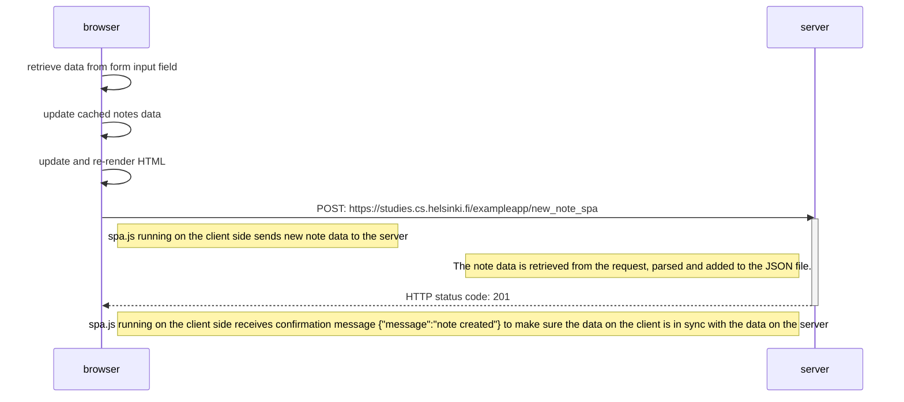

```mermaid
sequenceDiagram
    participant browser
    participant server

    browser->>browser: retrieve data from form input field
    browser->>browser: update cached notes data
    browser->>browser: update and re-render HTML
    browser->>server: POST: https://studies.cs.helsinki.fi/exampleapp/new_note_spa
    activate server
Note right of browser: spa.js running on the client side sends new note data to the server
Note left of server: The note data is retrieved from the request, parsed and added to the JSON file.
    server-->>browser: HTTP status code: 201
    deactivate server
Note right of browser: spa.js running on the client side receives confirmation message {"message":"note created"} to make sure the data on the client is in sync with the data on the server
```
