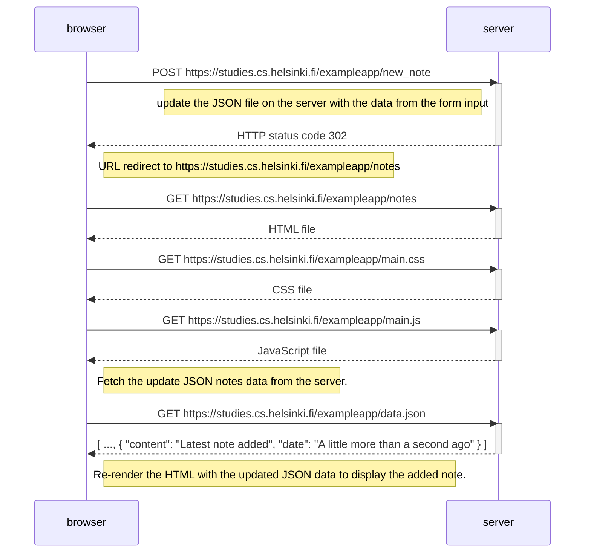

```mermaid
sequenceDiagram
    participant browser
    participant server
    
    browser->>server: POST https://studies.cs.helsinki.fi/exampleapp/new_note
    activate server

Note left of server: update the JSON file on the server with the data from the form input
    server-->>browser: HTTP status code 302
    deactivate server

Note right of browser: URL redirect to https://studies.cs.helsinki.fi/exampleapp/notes

    browser->>server: GET https://studies.cs.helsinki.fi/exampleapp/notes
    activate server
    server-->>browser: HTML file
    deactivate server

    browser->>server: GET https://studies.cs.helsinki.fi/exampleapp/main.css
    activate server
    server-->>browser: CSS file
    deactivate server

    browser->>server: GET https://studies.cs.helsinki.fi/exampleapp/main.js
    activate server
    server-->>browser: JavaScript file
    deactivate server

Note right of browser: Fetch the update JSON notes data from the server.

    browser->>server: GET https://studies.cs.helsinki.fi/exampleapp/data.json
    activate server
    server-->>browser: [ ..., { "content": "Latest note added", "date": "A little more than a second ago" } ]
    deactivate server

Note right of browser: Re-render the HTML with the updated JSON data to display the added note.


```
